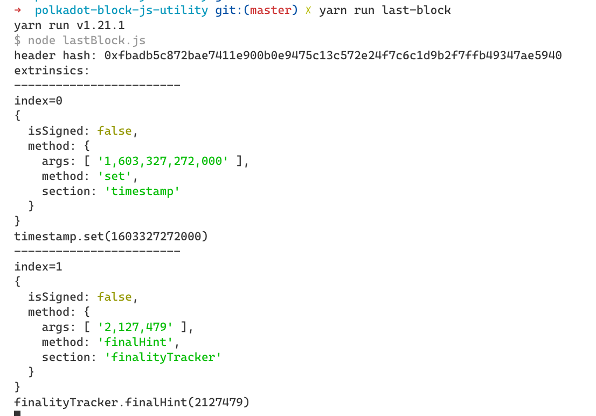
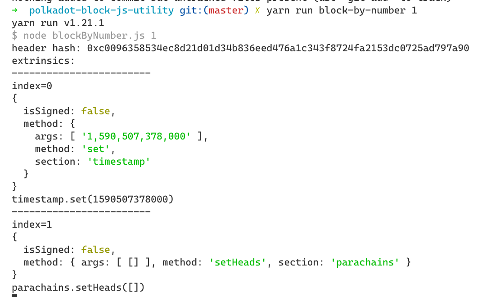
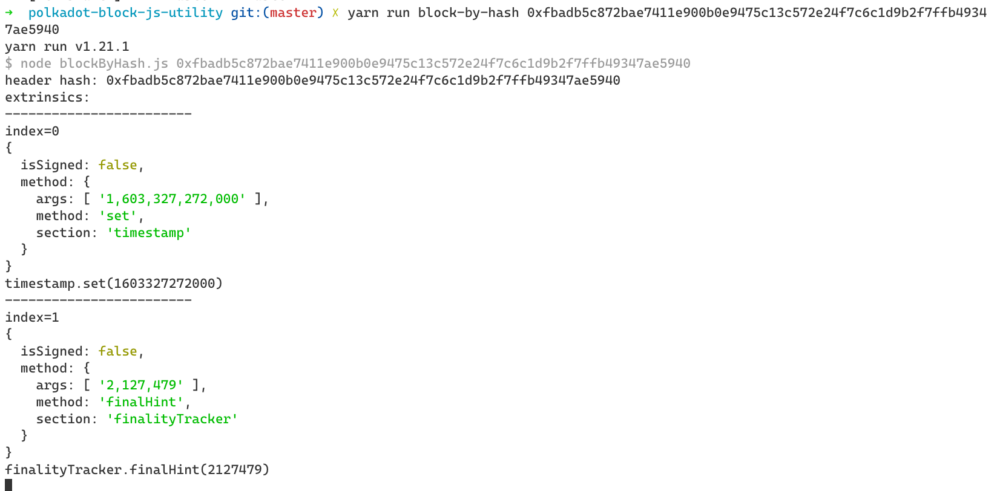

# Back-end JavaScript Utility

The back-end js utility provides CLI for
- last block query
- query by block number
- query by block hash

The block info will be printed to console, including header hash, extrinsic details.

## Build

Run: `yarn` to install dependencies.

## Run

### Last block query

Run `yarn run last-block`

Result:

### Query by block number

Run `yarn run block-by-number x`, where `x` is block number.

Result:

### Query by block hash

Run `yarn run block-by-hash x`, where `x` is the block hash.

Result:

